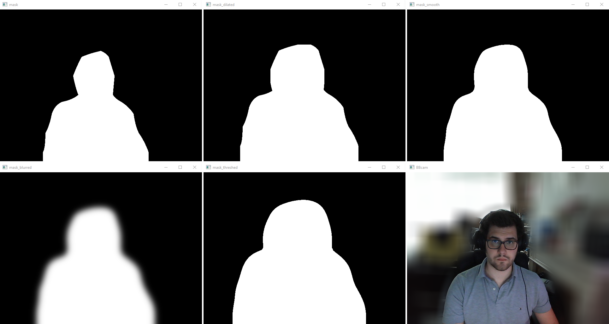

# BBCam
Blurred Background Camera

BBCam is a simple python project created to blur your background to maintain privacy.

This is made possible using Tensorflow BodyPix to split the foreground from the background.

Using OpenCV the mask is manipulated to be less obvious and give a seamless transition into the blurred background as seen in many commercial applications.

PyVirtualCam is used to send the openCV frames to existing virtual cameras such as OBS Virtual Webcam which can then be used by applications such as zoom, slack, Teams, etc.

parameters can be set from commandline, available arguments are:

--fps         # sets the fps of the webcam,         default: 20

--mtresh      # sets the bodypix mask treshhold,    default: 0.75

--mdil        # sets the mask dilation value,       default: 51

--msmooth     # sets the mask smoothing value,      default: mdil * 1.5

--mblur       # sets the mask feathering value,     default: 51

--bblur       # sets the background blur value,     default: 31

--headless    # hides the webcam window,            default: false

--debug       # shows debug cams,                   default: false

